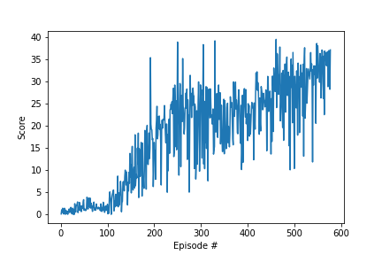

# Project 2: Report

### Implementation

The solution is implemented as a Deep Deterministic Policy Gradient (DDPG) model with experience replay. The `Agent` class defines an agent that uses data about the environment's state to choose an action and learn from its experience. The `Actor` class defines the deep neural network for the policy, mapping environment states to continuous agent actions. The `Critic` class defines the deep neural network for the Deep Q-Learning Critic, mapping environment states and actions to action-values. The `ActionNoise` class defines the process used to randomize actions at each step. The `ReplayBuffer` class stores past experiences that the agent samples from to update the model parameters. The `play_reacher()` function trains the agent and outputs scores for each episode.

### Learning Algorithm

The purpose of the learning algorithm is to parameterize a pair of deep neural networks to approximate the action-value (Q-value) function for the Critic and the policy function for the Actor in the Reacher environment. After initialization the agent interacts with the environment over a series of episodes. In each episode the agent considers the state of the environment, takes actions and receives rewards. Using this data over many episodes the agent updates its estimate of the action-value for each possible action given data about the state of the environment. 

The agent interacts with the environment by taking epsilon-greedy actions. Initially the agents act randomly selecting four random actions in the range [-1,1]. The `epsilon` value decays geometrically at a rate of 0.8% per episode until reaching a floor of `min(epsilon, 0.05)`. Each action updates the state of the environment and returns some reward. Then each experience observed by the agent is stored in the replay buffer. Every 2 steps through the environment the agent samples 128 experiences from the replay buffer.

The Critic model trains the model parameters using the Adam optimizer with a learning rate equal to `0.0003`. The Critic's object is to minimize the mean-squared error between the action values predicted by the network (Q_expected) and an estimate of the true action values (Q_targets). The true action values (Q_targets) are estimated as the current reward plus the value of future expected rewards, discounted by `gamma = 0.99`. The Actor model trains the model parameters using the Adam optimizer with a learning rate equal to `0.0001`. The Actor's objective is to maximize the mean action-values predicted by the Critic. Both the Actor and Critic use local and target networks to reduce the impact of correlation among sequential experiences. During each update step the agent updates the parameters of both target networks using the local networks with `tau = 0.001`.

The Critic model takes a state of size 37 and action of size 4 as inputs. The first layer contains 128 nodes with ReLU activation, the second layer contains 64 nodes with ReLU activation and the third layer contains 32 nodes with ReLU activation. Finally the network outputs one action value using ReLU activation. The Actor model takes a state of size 37 as input. The first layer contains 128 nodes with ReLU activation and the second layer contains 64 nodes with ReLU activation. Finally the network outputs four action values using tanh activation.

### Plot of Rewards

After 477 episodes, the successful agent was able to achieve an average score of +30 over its last 100 episodes.

### Ideas for Future Work

